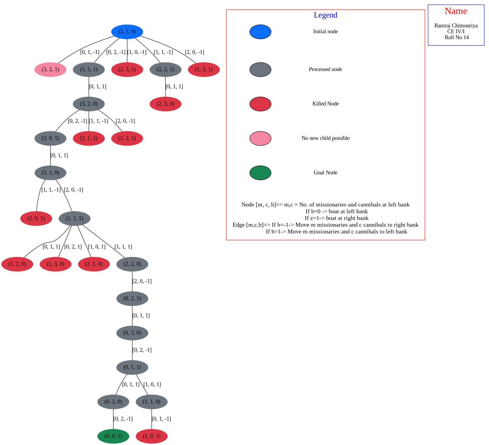

# Missionaries and Cannibals Problem

Set up virtual environment and install the dependencies using the commands:

```
python3 -m venv venv
source venv/bin/activate
pip install -r requirements.txt
```

Run the `main.py` file using the command:
```py
python main.py
```

The output is extracted in a png format and saved as `output.png`.

## State Space Tree
---



### Index

- Blue node - Initial node
- Grey node - Processed node
- Red Node - Killed node
- Pink Node - No new child possible node
- Green Node - Goal node
---
